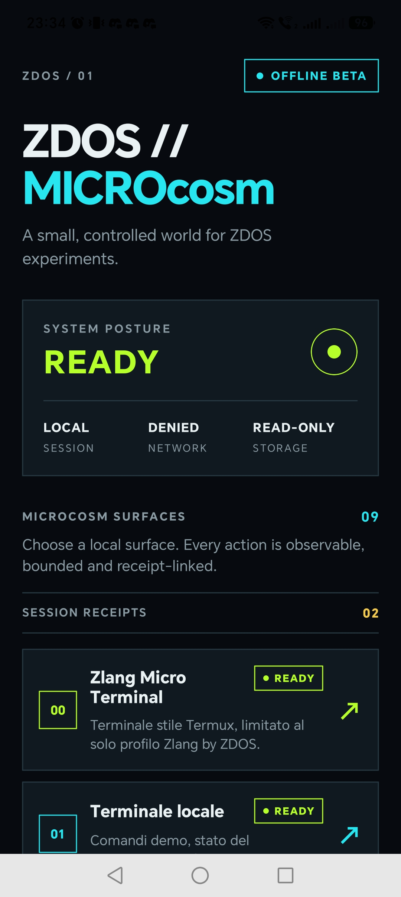
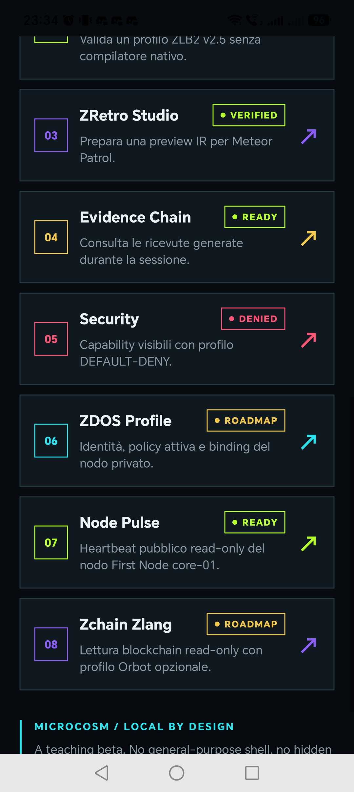

# ZDOS // MICROcosm

> A small, controlled world for ZDOS experiments.

**ZDOS // MICROcosm** è una teaching beta mobile/web per esplorare superfici ZDOS locali, osservabili e limitate. L’app non presenta un sistema operativo general-purpose: propone invece un microcosmo controllato in cui ogni azione è bounded, receipt-linked e soggetta a un profilo **DEFAULT-DENY**.



## Stato attuale

| Indicatore | Valore |
|---|---|
| Release | Offline Beta |
| System posture | READY |
| Session | LOCAL |
| Network | DENIED |
| Storage | READ-ONLY |
| Superfici disponibili | 09 |
| Session receipts | 02 nella schermata di riferimento |
| Esecuzione remota | Non configurata |
| Shell general-purpose | Non disponibile |

L’app è progettata per mantenere il perimetro locale e leggibile. Il profilo di default nega le capacità non dichiarate; non vengono eseguiti comandi shell arbitrari, non vengono aperte connessioni remote e il nodo privato mostrato nell’app è soltanto un’identità descrittiva finché il trasporto non viene configurato.

## Microcosm surfaces

La schermata principale presenta un catalogo di superfici locali. Ogni superficie ha un numero, una descrizione, uno stato e un accesso visuale dedicato.

| Superficie | Stato | Scopo |
|---|---|---|
| **00 — Zlang Micro Terminal** | READY | Terminale in stile Termux limitato al profilo Zlang by ZDOS. |
| **01 — Terminale locale** | READY | Comandi demo e stato del microcosmo locale. |
| **02 — Zlang Validator** | ACCEPTED / DENIED | Valida il profilo ZLB2 v2.5 senza compilatore nativo. |
| **03 — ZRetro Studio** | VERIFIED | Prepara una preview IR per il progetto Meteor Patrol. |
| **04 — Evidence Chain** | READY | Consulta le ricevute generate durante la sessione. |
| **05 — Security** | DENIED | Mostra le capability visibili con il profilo DEFAULT-DENY. |
| **06 — ZDOS Profile** | ROADMAP | Presenta identità, policy attiva e binding del nodo privato. |
| **07 — Node Pulse** | READY | Mostra un heartbeat pubblico read-only del nodo First Node core-01. |
| **08 — Zchain Zliang** | ROADMAP | Prevede la lettura blockchain read-only con profilo Orbot opzionale. |
| **09 — ZComm Telecom** | READY | Osserva una fixture telecom in Zlang senza trasmettere o aprire socket. |



## Contratti locali della beta

La logica dimostrativa è concentrata in `lib/zdos-demo.ts` e definisce un insieme ridotto di contratti deterministici.

### Zlang Micro Terminal

Il terminale riconosce soltanto comandi appartenenti al profilo demo. Gli input sconosciuti vengono rifiutati con `DENIED`; non vengono passati a una shell del sistema operativo.

### Zlang Validator

Il validatore accetta sorgenti che iniziano con `emit ` e restituisce il profilo:

```text
ZLB2 v2.5 · emit · HALT
```

La sintassi non appartenente al profilo supportato viene respinta con `DENIED`.

### ZRetro Studio

La preview locale restituisce lo stato `VERIFIED` e il dettaglio `IR READY · manifest prepared`. Nella beta attuale questa è una preview contrattuale, non un compilatore o un generatore IR completo.

### ZComm Telecom

`ZComm Telecom` è il primo tool telecomunicazioni della beta. Il suo programma è scritto interamente nel profilo locale Zlang `ZLB2 telecom.local` e permette soltanto osservazione bounded di una fixture UHF, ispezione read-only del percorso e negazione esplicita della trasmissione.

Il template eseguibile è:

```zlang
telecom.status
telecom.scan band=uhf
telecom.route inspect
telecom.tx deny
halt
```

Il risultato atteso è `ACCEPTED`, con link `LOCAL OBSERVATION`, route `READ-ONLY` e `transmit: DENIED`. Il parser rifiuta comandi per socket, radio, rete o trasmissione e non esegue alcuna operazione telecom reale. `halt` è obbligatorio per chiudere il profilo.

### Evidence Chain e ZTRACE

Le operazioni demo possono produrre receipt con identificativo, operazione, stato e dettaglio. `computeZtrace()` genera un fingerprint deterministico della superficie e del numero di receipt. Il trace è un identificatore di sessione per la demo e non deve essere interpretato come firma crittografica o come audit persistente.

## Profilo e nodo privato

`lib/zdos-node.ts` contiene il profilo dichiarativo `zdos-node/v1` per il nodo privato associato alla beta. Il profilo espone soltanto le capacità:

```text
node.status
evidence.append
manifest.preview
```

Il nodo è marcato come `IDENTIFIED`, ma mantiene intenzionalmente i seguenti limiti:

```text
transport: not-configured
remoteExecution: false
networkExposure: false
posture: DEFAULT-DENY
```

Il repository non conserva password, token, chiavi SSH o credenziali operative del nodo.

## Architettura tecnica

Il progetto usa Expo Router per il routing, React Native/TypeScript per l’applicazione e NativeWind/Tailwind per lo stile. Il backend template include tRPC, autenticazione OAuth e Drizzle ORM con MySQL, ma il dominio ZDOS mostrato nella UI è ancora locale e non dipende da un servizio remoto.

| Directory | Responsabilità |
|---|---|
| `app/` | Schermate Expo Router, layout globale e callback OAuth. |
| `components/` | Componenti visuali riutilizzabili e tematizzati. |
| `lib/zdos-demo.ts` | Contratti locali per terminale, validazione, preview e receipt. |
| `lib/zdos-telecom.ts` | Interprete bounded del profilo telecom Zlang locale. |
| `lib/zdos-node.ts` | Profilo descrittivo del nodo ZDOS. |
| `lib/trpc.ts` | Client tRPC e collegamento al backend. |
| `server/` | Router, autenticazione e servizi infrastrutturali. |
| `drizzle/` | Schema e migrazioni MySQL. |
| `tests/` | Test dei contratti demo e dell’autenticazione. |
| `docs/screenshots/` | Screenshot di riferimento della UI. |

## Sicurezza e limiti intenzionali

Il progetto adotta un modello **local by design**. La rete è negata nella postura mostrata, lo storage è read-only nella superficie principale e le capacità non dichiarate vengono negate. Questi limiti sono parte del comportamento previsto della beta, non errori di configurazione.

`ZComm Telecom` è un simulatore didattico locale: non sostituisce un modem, uno scanner RF, un client SIP, una radio o un sistema di monitoraggio di rete.

Le funzionalità indicate come `ROADMAP` sono segnali di direzione progettuale. In particolare, il profilo ZDOS, Node Pulse e Zchain Zliang non devono essere interpretati come integrazioni remote o blockchain operative già disponibili nel repository.

## Sviluppo locale

Requisiti consigliati:

- Node.js 22 o compatibile;
- pnpm;
- variabili d’ambiente del template, quando richieste dal backend o dall’autenticazione.

Installazione e avvio:

```bash
pnpm install
pnpm dev:metro
```

Per eseguire i test:

```bash
pnpm test -- --run
```

Per verificare i tipi TypeScript:

```bash
pnpm exec tsc --noEmit
```

Il bundle JavaScript Android già esportato localmente si trova in `dist-android/` e può essere rigenerato con:

```bash
npx expo export --platform android --output-dir dist-android
```

La generazione di un APK nativo richiede un ambiente Android SDK/Gradle configurato; questo workspace contiene invece l’export Expo Android e non include una cartella nativa `android/`.

## Direzione del progetto

Le evoluzioni naturali del microcosmo sono la persistenza delle receipt, un audit log server-side, capability grant/revoke espliciti, test end-to-end per OAuth e una definizione formale del modello di minaccia prima di qualsiasi attivazione del trasporto remoto.

Fino ad allora, ZDOS // MICROcosm resta ciò che dichiara di essere: **una piccola, controllata e osservabile area di esperimenti ZDOS**.

## Licenza

Consultare la licenza e le policy del repository per i termini di utilizzo del progetto.

## Riferimenti

- [Repository GitHub](https://github.com/high-cde/zdos-microcosm-beta)
- [Expo](https://expo.dev/)
- [Expo Router](https://docs.expo.dev/router/introduction/)
- [Drizzle ORM](https://orm.drizzle.team/)
- [tRPC](https://trpc.io/)
